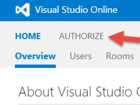
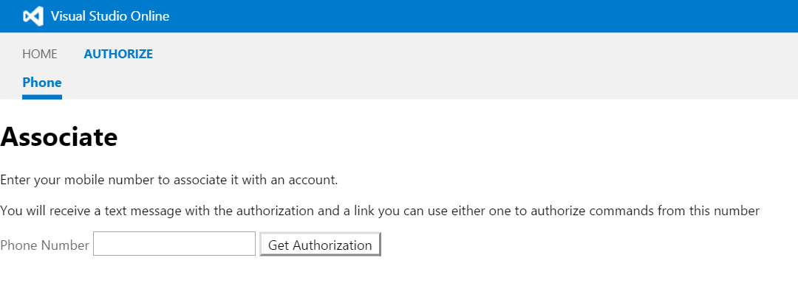

#Visual Studio Team Services SMS demo

This demo is part of a VSLive Orlando 2015 Session [VSH16-Getting More Out of Visual Studio Online Integration and Extensibility](https://live360events.com/Events/Orlando-2015/Sessions/Thursday/VSH16-Getting-More-Out-of-Visual-Studio-Online-Integration-and-Extensibility.aspx)

All code is copyright Tiago Pascoal under the MIT license (see [license](LICENSE))

A *very simple_* demo how to leverage VSTS-node-api to drive applications, it is a demo that leverages both extensions, a server working on behalf of an user using OAuth and leveraging the
[REST API](https://www.visualstudio.com/integrate/get-started/rest/basics) using the nodejs official library  but it's probably not something that is going to be used in the real world.

The code is not meant to be seen as a nodejs application best practice implementation and it is definitely NOT production ready. It is a demo and should be seen as such :-)

The server is a very on simple implementation (emphasizes on simple) of an SMS gateway to Visual Studio Online that can be use to send (and receive responses) commands to 
your VSTS account via SMS text messages

The gateway is implemented using nodejs and uses VSTS REST API to interact with Visual Studio Online. It uses express and has been implemented in the most simplest way possible 
(html static files, no MVC pattern, no views engine. It's not a very clean implementation but I belive it's simple enough to be read by people who have no experience with express).

It uses [vso-node-api](https://www.npmjs.com/search?q=vso-node-api) to interact with Visual Studio Online

Pre Requirements
* [twilio](https://twilio.com) account to receive and send SMS (a free trial account is fine (although all numbers need to be verified to be used)) 
* VSTS account
* [Register an application on VSTS](https://app.vssps.visualstudio.com/app/register) if you wish to use OAUth
* the code needs to executed on a machine that is accessible from the internet
* nodejs (any version)
* have a valid certificate if you want to use OAuth (OAuth requires HTTPS) 
  * self signed certificate will work if manually accept it on the browser before accesing the extension

It supports
* [Basic Authentication](https://www.visualstudio.com/en-us/integrate/get-started/auth/overview)
* Personal Access Token
* [OAuth authentication](https://www.visualstudio.com/integrate/get-started/auth/oauth)

With OAuth the commands will be issued under the user account that has been associate/authorized with a given phone, with basic/Personal access token all commands will be issues with a 
fixed user account (and ANY user that knows the phone number used to receive commands can issue them).

In order to use OAuth you can either access authorization pages directly (/index.html) or install a VSTS Extension in order to be able to authorize a 
mobile number directly from Visual Studio Online

## Configuring your application for OAuth

The only parameter than you need to enter (besides the name,etc) is the callback.

The callback is a relative url (/callback) the URL of the server depends where you are going to install the gateway on.

It should be something like https://YOUR_FQDN:3001/callback

## Installing the application

In order to show you can run this on un*x environment, the provided instructions are for a un*x machine but this can also be installed on a windows machine.

This is a standard nodejs application, so you just need install the required npm modules before starting the application

issue the command 
```sh
npm install 
```
to install all required npm packages

## Registering the application in VSTS in order to use OAuth

You can [Register the application on VSTS](https://app.vssps.visualstudio.com/app/register)

To use the demo as is, the only required scope is VSTS.build_execute

## Running the application

edit start.sh in order to fill your specific configuration data

* TWILIO_ACCOUNT_SID - twilio account sid
* TWILIO_AUTH_TOKEN - twilio authentication code
* TWILIO_NUMBER -twilio number used to receive commands and send responses back
* VSTS_SERVER - the URL for your VSTS account collection url 
* VSTS_AUTH_TYPE - the type of authentication. Can be basic, pta or oauth
* VSTS_USER - VSTSUser account or user personal access token to use (if using pta or basic auth doesn't apply to OAuth) to access VSTS.
* VSTS_PATH - user password (if using basic auth)
* OAUTH_APPID - OAuth application id (if using OAuth)
* OAUTH_APPSECRET - OAuth application secret
* OAUTH_SCOPE - the authorized scopes authorized (the demo only requires VSTS.build_execute since it only implements one command :-))
* OAUTH_CALLBACKURL - the url of the server callback (as configured in your application previously)
* SMS_PUBLIC_URL - The absolute base URL that will be sent on the authorization SMS text something like (https://YOUR_FQDN:3001). Don't add a path  

run the server by issuing the command 
```sh
./start.sh
```

The server is going to run on port 3000 and port 3001 (if you have server certificates). (this can be changed on server.js file)

To test if it's running access http://YOURSERVER/ping to see if the server responds

(running this as a daemon is left as an exercise to the reader :-))





If you have installed VSTS extension you can now access on the homepage or you can acess directly on the browser https://YOUR_FQDN:3001/index.html and enter your phone number to authorize it

